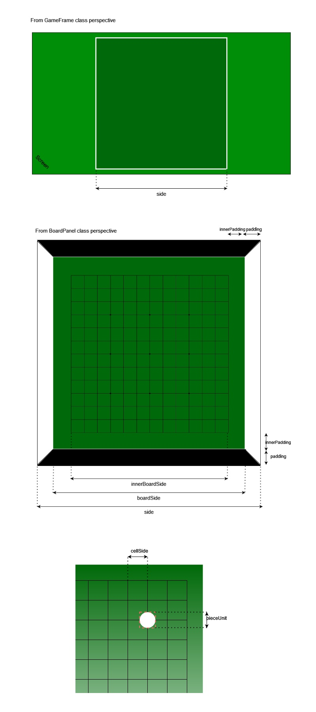

# Quentin-by-ALMO
Quentin's project presented by ALMO.

## Game Implementation
Documentation regarding project commission was ambiguous, so we took the liberty of choosing a specific way to implement
some rules.
These "foggy" rules include:
1) Invalid moves rule
2) Pie Rule: we decided to swap player color, not board side color
3) Victory Condition: draws are not possible but that was equivocal, so we implemented a "last chance" solution
in case draw happens

## Execution
Execution can be done through:

1) shell (execute file 'ShellApplicationRunner.java')
2) dedicated GUI (execute file 'GUIApplicationRunner.java')

## GUI Board Panel Representation
To help understand names used in the BoardPanel class to represent the game board, here's a simple image:

